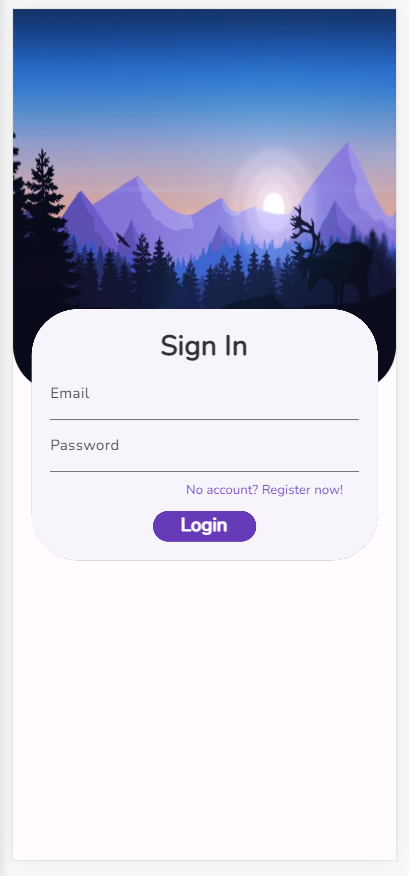
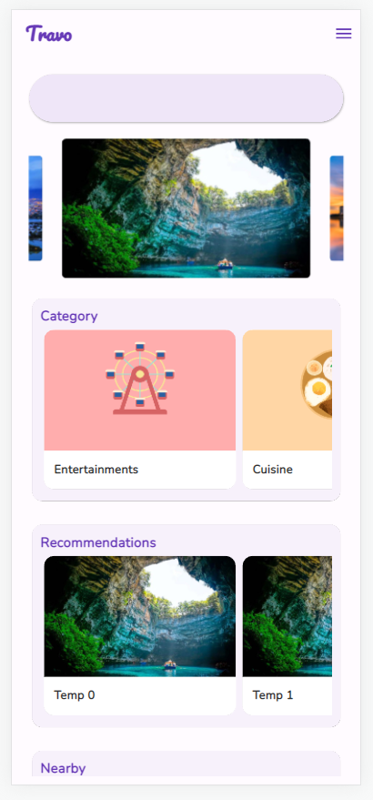
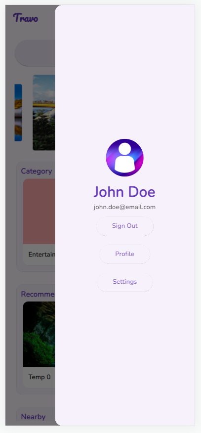
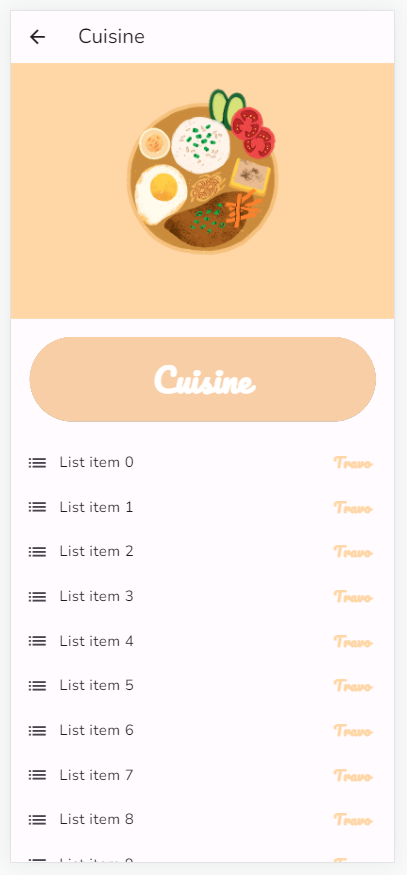
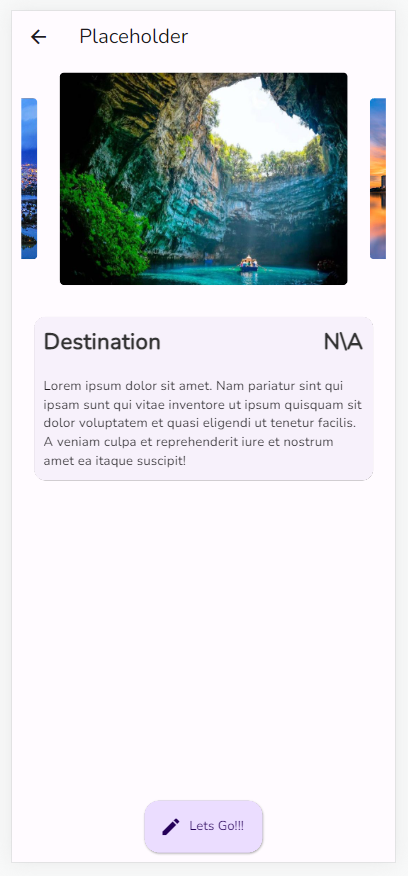
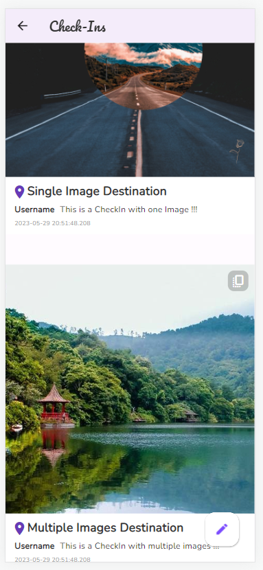

  

  <h3 align="center">Travo</h3>

  

    Traveling to new places is harsh, book a tour-guided trip would involves a traveling schedule that may not fit your physical condition, visiting places you are not interested in,... while traveling alone is a pain due to the excessive amount of research from all sources about what to do, where to go, what may interests you and what not,...Travo is a full-stack application developed to solve that problem, built as a mobile app functioning based on a self-built API which contains categorized information about tourist attractions all around Viet Nam.
  

## No Description, here's the UI up to this moment
0. Splash Screen

1. Sign In - Register Screen

2. Home Screen

3. Home - Open Drawer

4. Listing Screen

5. Detail Screen

6. Check-Ins Listing Screen

## Creators

**Creator 1**

- <https://github.com/ngkhuong831>

Enjoy :metal:
