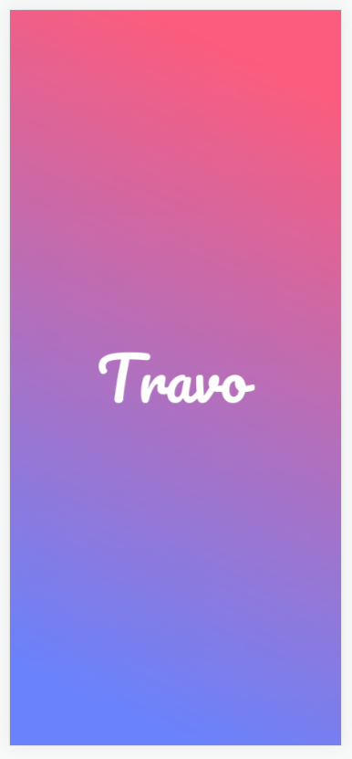
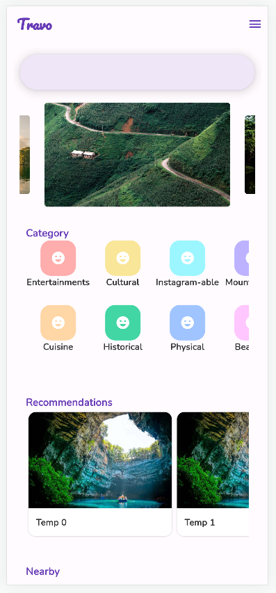
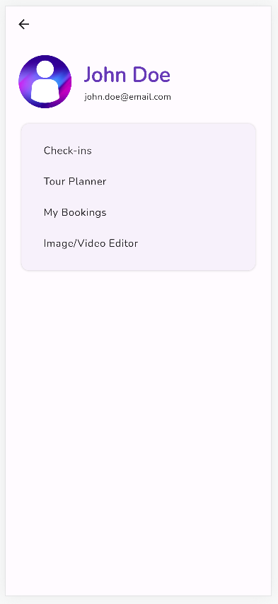

  

  <h3 align="center">Travo</h3>

  

    Traveling to new places is harsh, book a tour-guided trip would involves a traveling schedule that may not fit your physical condition, visiting places you are not interested in,... while traveling alone is a pain due to the excessive amount of research from all sources about what to do, where to go, what may interests you and what not,...Travo is a full-stack application developed to solve that problem, built as a mobile app functioning based on a self-built API which contains categorized information about tourist attractions all around Viet Nam.
  

### WORKING ON: DATA POOL AND BACKEND APIS

## HOW TO RUN

0. Make sure you have installed a stable version of Flutter and have related Android SDKs downloaded.

1. Pull this repo / Download and unzip this repo.

2. Open Terminal.

3. Run 'flutter pub get' to fetch all dependencies.

  - If problems arises, run 'flutter doctor' for diagnosis and fix it correspondingly.

4. Turn on your Virtual Device / Plug in your debugging device 

5. Run 'flutter run'.

  - In case you just want to see a quick preview, you can use the Google Dev Tool to see a preview of the UI:
    + Terminal will display a list of options to run on ('Window', 'Chrome',etc...)
    + Select Chrome using the corresponding number
    + Once opened, press F12 to turn on DevTools
    + Choose screen sizes by device options to view the UI correspondingly

## No Description, here's the UI up to this moment
0. Splash Screen

1. Sign In - Register Screen

2. Home Screen

3. Home - Open Drawer

4. Listing Screen

5. Detail Screen

5. Profile Screen 

6. Check-Ins Listing Screen

## Creators

**Creator 1**

- <https://github.com/ngkhuong831>

Enjoy :metal:
